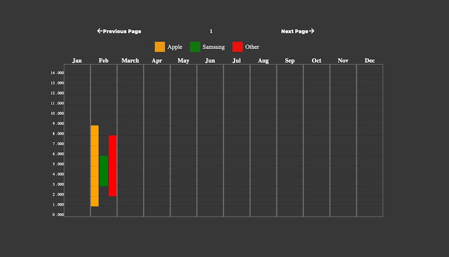

React Multi Date Range Viewer
#The module is still in test process
react-multi-range-viewer is a React component for visualizing and selecting ranges on a calendar. It's designed to be flexible and easy to integrate into your React applications.

🚀 Features

Dynamic Range Selection: Allows users to select and view multiple date ranges.
Customizable: Easily customize the appearance of the calendar and date ranges.
Flexible Date Handling: Supports various date formats and locales.
⚠️ Under Testing

This library is currently under testing and development. While we are working hard to make it stable and reliable, please be aware that some features may be experimental or subject to change. We appreciate your feedback and contributions to help improve this library.

📦 Installation

To install react-multi-range-viewer, use npm or yarn:

bash
Copy code
npm install react-multi-date-range-viewer
or

bash
Copy code
yarn add react-multi-range-viewer



Example of use

```jsx
import React from "react";
import RangeViewer from "react-multi-date-range";
import moment from "moment";

const App = () => {
  const data = [
    {
      startDate: moment().toDate(),
      endDate: moment().add(2, "days").toDate(),

      key: "1",
      type: "leave",
      color: "red",
      textColor: "white",
      cellTextColor: "blue",
    },
    {
      startDate: moment().add(10, "days").toDate(),
      endDate: moment().add(12, "days").toDate(),

      key: "2",
      type: "WorkTime",
      color: "orange",
      textColor: "white",
    },
  ];

  return (
    <div
      style={{
        height: "500px",
        width: "700px",
        margin: "auto",
        marginTop: "10%",
      }}>
      <RangeViewer
        loading={false}
        backgroundColor="#383838"
        activeDate={moment().toDate()}
        textColor="#fff"
        borderColor="lightGray"
        handleRangeClick={(range: any) => console.log("Range clicked:", range)}
        onShownDateChange={(date: any) => console.log("Date changed:", date)}
        data={data}
        guidHeaderColor="red"
        beginDayOfWeek={"monday"} //'sunday' or 'monday'
        GuildComponent={<GuildComponent theme="dark" />}
      />
    </div>
  );
};

export default App;
const GuildComponent = ({ theme }: { theme: string | undefined }) => (
  <div
    className="guid-colors-parent"
    style={{
      color: theme === "dark" ? "whiteSmoke" : "#585858",
      fontWeight: "bold",
    }}>
    <span>
      <span className="guid-colors1"></span>
      <span>Sick</span>
    </span>
    <span>
      <span className="guid-colors2"></span>
      <span>Work</span>
    </span>
  </div>
);
```
